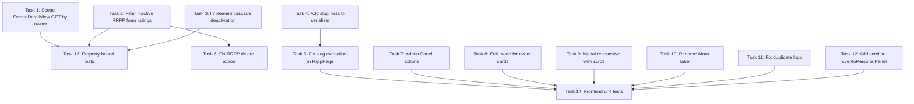

# Implementation Tasks

## Task Dependency Graph


## Tasks

### Task 1: Backend - Scope EventoDetailView GET by owner
- **Priority**: HIGH (Security / Multi-Tenant Isolation)
- **Requirements**: Req 1
- **Files to modify**:
  - `api/apps/eventos/views.py`
- **Details**:
  Actualmente `EventoDetailView` es pública y no verifica ownership en GET.
  Cuando un Dueño autenticado solicita el detalle de un evento ajeno, debe retornar 403.
  Usuarios anónimos y otros roles mantienen acceso público (cartelera).

  Sobreescribir `retrieve()` en `EventoDetailView`:
  ```python
  def retrieve(self, request, *args, **kwargs):
      evento = self.get_object()
      if (request.user.is_authenticated
          and request.user.rol == 'dueno'
          and evento.organizador != request.user):
          return Response(status=status.HTTP_403_FORBIDDEN)
      return Response(self.get_serializer(evento).data)
  ```

  Los endpoints PATCH y POST cancelar ya verifican ownership correctamente.
  El manejo de ID inexistente (404) ya funciona vía DRF `get_object_or_404`.

- [ ] Implement ownership check in `EventoDetailView.retrieve()`
- [ ] Test: Dueño A no puede GET evento de Dueño B → 403
- [ ] Test: Dueño A puede GET su propio evento → 200
- [ ] Test: Usuario anónimo puede GET cualquier evento → 200 (cartelera pública)
- [ ] Test: ID inexistente → 404

### Task 2: Backend - Filter inactive RRPP from listings
- **Priority**: HIGH (Security / Multi-Tenant Isolation)
- **Requirements**: Req 2, 3
- **Files to modify**:
  - `api/apps/rrpp/views.py`
- **Details**:
  `RRPPListCreateView.get` ya filtra por `organizador=request.user` pero no excluye
  RRPP cuyos usuarios están inactivos (`is_active=False`). Al desactivar un RRPP,
  este sigue apareciendo en el listado.

  Agregar filtro en `RRPPListCreateView.get`:
  ```python
  def get(self, request):
      rrpps = RRPP.objects.filter(
          organizador=request.user,
          usuario__is_active=True,  # AGREGAR
      ).select_related('usuario').prefetch_related(
          'asignaciones__evento', 'asignaciones__links',
      )
      return Response(RRPPSerializer(rrpps, many=True).data)
  ```

  Verificar que SimpleJWT ya rechaza login de usuarios inactivos (la regla
  `USER_AUTHENTICATION_RULE` default verifica `is_active`). Confirmar en settings.

- [ ] Add `usuario__is_active=True` filter to `RRPPListCreateView.get`
- [ ] Verify SimpleJWT `USER_AUTHENTICATION_RULE` is not overridden in settings
- [ ] Test: RRPP desactivado no aparece en listado de su Dueño
- [ ] Test: RRPP activo sigue apareciendo normalmente
- [ ] Test: RRPP desactivado no puede obtener token (login rechazado)

### Task 3: Backend - Implement atomic cascade deactivation in OrganizadorDetailView.destroy
- **Priority**: HIGH (Data Integrity / Cascade)
- **Requirements**: Req 11
- **Files to modify**:
  - `api/apps/cuentas/views.py`
- **Details**:
  Actualmente `OrganizadorDetailView.destroy` solo hace `instance.is_active = False`.
  Falta desactivar todo el personal asociado (RRPP, guardias, cajeras) y sus asignaciones.

  Implementar cascada atómica:
  ```python
  from django.db import transaction
  from apps.rrpp.models import RRPP, AsignacionRRPP, LinkRRPP
  from .models import AsignacionStaff

  def destroy(self, request, *args, **kwargs):
      instance = self.get_object()

      # Idempotente: si ya está inactivo, no hacer nada
      if not instance.is_active:
          return Response(status=status.HTTP_204_NO_CONTENT)

      with transaction.atomic():
          # 1. Desactivar el organizador
          instance.is_active = False
          instance.save(update_fields=['is_active'])

          # 2. Desactivar RRPP del organizador
          rrpps = RRPP.objects.filter(organizador=instance)
          rrpp_user_ids = rrpps.values_list('usuario_id', flat=True)
          Usuario.objects.filter(id__in=rrpp_user_ids).update(is_active=False)

          # 3. Desactivar staff (guardias, cajeras)
          Usuario.objects.filter(
              organizador=instance, rol__in=['guardia', 'cajera']
          ).update(is_active=False)

          # 4. Desactivar AsignacionRRPP y LinkRRPP
          asignaciones_rrpp = AsignacionRRPP.objects.filter(rrpp__in=rrpps)
          asignaciones_rrpp.update(activa=False)
          LinkRRPP.objects.filter(asignacion__in=asignaciones_rrpp).update(activo=False)

          # 5. Desactivar AsignacionStaff
          staff_ids = Usuario.objects.filter(
              organizador=instance, rol__in=['guardia', 'cajera']
          ).values_list('id', flat=True)
          AsignacionStaff.objects.filter(usuario_id__in=staff_ids).update(activa=False)

      return Response(status=status.HTTP_204_NO_CONTENT)
  ```

  La transacción `atomic()` garantiza rollback si cualquier operación falla.

- [ ] Import required models (RRPP, AsignacionRRPP, LinkRRPP, AsignacionStaff)
- [ ] Implement idempotency check (already inactive → 204 without changes)
- [ ] Implement `transaction.atomic()` block with full cascade
- [ ] Deactivate RRPP users associated with the organizador
- [ ] Deactivate staff users (guardia, cajera) associated with the organizador
- [ ] Deactivate all AsignacionRRPP for those RRPP
- [ ] Deactivate all LinkRRPP for those asignaciones
- [ ] Deactivate all AsignacionStaff for associated staff
- [ ] Test: Cascade deactivates all related resources
- [ ] Test: Idempotency — already inactive org returns 204 without side effects
- [ ] Test: Atomicity — simulated failure rolls back all changes

### Task 4: Backend - Add slug_lista field to AsignacionConEstadisticasSerializer
- **Priority**: HIGH (Core Functionality)
- **Requirements**: Req 4, 5
- **Files to modify**:
  - `api/apps/rrpp/serializers.py`
- **Details**:
  El frontend del RRPP no puede encontrar el `slug_lista` porque está anidado dentro de
  `links[].slug` y la normalización no lo extrae correctamente. Agregar campo de primer
  nivel `slug_lista` al serializer para facilitar el acceso.

  En `AsignacionConEstadisticasSerializer`:
  ```python
  slug_lista = serializers.SerializerMethodField()

  def get_slug_lista(self, asignacion):
      link = asignacion.links.filter(tipo='lista', activo=True).first()
      return str(link.slug) if link else None
  ```

  Agregar `'slug_lista'` a la lista de `fields` del serializer.

- [ ] Add `slug_lista` SerializerMethodField to `AsignacionConEstadisticasSerializer`
- [ ] Implement `get_slug_lista` method (filter by tipo='lista', activo=True)
- [ ] Add 'slug_lista' to serializer Meta fields
- [ ] Test: Response includes `slug_lista` with correct slug value
- [ ] Test: Returns None when no active lista link exists

### Task 5: Frontend - Fix slug extraction in RrppPage normalizeRrppEvent
- **Priority**: HIGH (Core Functionality)
- **Requirements**: Req 4, 5
- **Depends on**: Task 4
- **Files to modify**:
  - `src/pages/RrppPage.jsx`
- **Details**:
  `normalizeRrppEvent` busca `source.slug` y `source.lista_slug` que no existen en la
  respuesta del serializer. El slug está dentro de `links[].slug` (tipo 'lista').
  Con el campo `slug_lista` agregado en Task 4, el frontend ahora puede consumirlo
  directamente. Además, agregar fallback a `links[0].slug` para robustez.

  Ajustar `normalizeRrppEvent`:
  ```javascript
  function normalizeRrppEvent(event, index) {
    // ... existing mapping ...
    const links = Array.isArray(source.links) ? source.links : []
    const listaLink = links.find(l => l.tipo === 'lista')
    const slug = firstDefined(source.slug_lista, source.slug, source.lista_slug, listaLink?.slug)
    // ...
    return {
      // ...
      slug: slug || null,
      links,
      // ...
    }
  }
  ```

  Verificar que `submitGuest` en la misma página usa `selectedEvent.slug` correctamente
  para el payload `slug_lista`.

- [ ] Update `normalizeRrppEvent` to prioritize `source.slug_lista` from backend
- [ ] Add fallback to extract slug from `links[]` array (tipo='lista')
- [ ] Preserve `links` array in normalized event for reference
- [ ] Verify `submitGuest` sends correct `slug_lista` in payload
- [ ] Test: Normalized event has correct slug when backend provides `slug_lista`
- [ ] Test: Fallback works when `slug_lista` is null but links array has lista link

### Task 6: Frontend - Fix RRPP delete action call and list refresh
- **Priority**: HIGH (Core Functionality)
- **Requirements**: Req 3
- **Depends on**: Task 2
- **Files to modify**:
  - `src/pages/RrppPage.jsx` (or equivalent Dueño RRPP management page)
- **Details**:
  Después de ejecutar DELETE en un RRPP, el frontend no refresca la lista, por lo que
  el RRPP desactivado sigue visible hasta el próximo fetch manual. Con el fix de Task 2
  (backend filtra inactivos), al refrescar el RRPP ya no aparecerá.

  Asegurar que la función de eliminación:
  1. Llama a `DELETE /api/rrpp/:id/` correctamente
  2. Tras respuesta exitosa (200), hace `refetch()` o elimina el item del state local
  3. Muestra confirmación antes de ejecutar (window.confirm o modal)

  ```javascript
  const handleDeleteRrpp = async (rrppId, nombre) => {
    if (!window.confirm(`¿Eliminar a "${nombre}"? Se desactivará su acceso.`)) return
    try {
      await api.delete(`/rrpp/${rrppId}/`)
      // Refrescar lista — el backend ya no retornará el RRPP inactivo
      refetch() // o setRrpps(prev => prev.filter(r => r.id !== rrppId))
      toast.success('RRPP eliminado correctamente')
    } catch (err) {
      toast.error(err.response?.data?.detail || 'Error al eliminar RRPP')
    }
  }
  ```

- [ ] Verify delete action calls correct endpoint (`DELETE /api/rrpp/:id/`)
- [ ] Add list refresh (refetch) after successful deletion
- [ ] Add confirmation dialog before deletion
- [ ] Add success/error toast notifications
- [ ] Test: After deletion, RRPP disappears from list without page reload

### Task 7: Frontend - Add Edit/Reactivate/Reset-password actions to AdminPage
- **Priority**: MEDIUM
- **Requirements**: Req 9, 10
- **Files to modify**:
  - `src/pages/AdminPage.jsx`
- **Details**:
  El backend ya soporta PATCH con `is_active`, `password`, y campos editables.
  El frontend necesita botones y modales para ejecutar estas acciones.

  1. **Botón "Reactivar"** (visible solo cuando `org.is_active === false`):
  ```jsx
  {!org.is_active && (
    <button onClick={() => handleReactivate(org.id, org.nombre)}>
      Reactivar
    </button>
  )}
  ```

  2. **`handleReactivate` implementation:**
  ```javascript
  const handleReactivate = async (id, nombre) => {
    if (!window.confirm(`¿Reactivar al organizador "${nombre}"?`)) return
    try {
      await api.patch(`/admin/organizadores/${id}/`, { is_active: true })
      refetch()
    } catch (err) { /* handle error */ }
  }
  ```

  3. **Modal de edición** — Extender `OrganizadorFormModal` (o crear modo edición):
     - Precarga campos: nombre, apellido, email, teléfono, username
     - Campo opcional de nueva contraseña (mínimo 8 caracteres)
     - PATCH al submit con solo campos modificados
     - Validar unicidad de username/email (mostrar error del backend)

  4. **Botón "Editar"** en la columna de acciones de cada organizador.

  5. **Botón "Eliminar" (desactivar)** con confirmación.

- [ ] Add "Reactivar" button (visible only for inactive orgs)
- [ ] Implement `handleReactivate` with confirmation and refetch
- [ ] Add "Editar" button that opens edit modal
- [ ] Extend OrganizadorFormModal for edit mode (precarga de datos)
- [ ] Add optional password reset field in edit modal (min 8 chars)
- [ ] Add "Eliminar" button with confirmation dialog
- [ ] Refetch list after any mutation (edit/reactivate/delete)
- [ ] Test: Reactivate changes org status and refreshes list
- [ ] Test: Edit modal shows pre-filled data and submits PATCH
- [ ] Test: Password reset field validates minimum length

### Task 8: Frontend - Implement edit mode trigger in event cards for NocheFormModal
- **Priority**: MEDIUM
- **Requirements**: Req 6
- **Files to modify**:
  - `src/components/NocheFormModal.jsx`
  - `src/pages/NochesTab.jsx` (or equivalent events listing component)
- **Details**:
  `NocheFormModal` ya soporta modo edición (prop `evento` != null precarga valores
  y usa PATCH). Falta el trigger en la UI: un botón "Editar" en las tarjetas de eventos
  del Dueño.

  1. **Agregar botón "Editar"** en cada tarjeta de evento (NochesTab):
  ```jsx
  {evento.estado !== 'cancelado' && (
    <button onClick={() => setEditingEvento(evento)}>Editar</button>
  )}
  ```

  2. **Abrir modal en modo edición:**
  ```jsx
  <NocheFormModal
    open={!!editingEvento}
    onClose={() => setEditingEvento(null)}
    evento={editingEvento}  // null = crear, object = editar
    onSuccess={refetch}
  />
  ```

  3. **Optimizar PATCH** — Enviar solo campos modificados:
  ```javascript
  const handleSubmit = async (e) => {
    e.preventDefault()
    if (!validate() || submitting) return
    const original = formFromEvento(evento)
    const payload = {}
    Object.keys(form).forEach(key => {
      if (form[key] !== original[key]) payload[key] = form[key]
    })
    if (isEdit && Object.keys(payload).length === 0) return // Sin cambios
    // ...submit
  }
  ```

  4. **Bloquear edición de eventos cancelados**: Deshabilitar botón o mostrar tooltip.

- [ ] Add "Editar" button to event cards in NochesTab (hidden for cancelled events)
- [ ] Add state `editingEvento` to manage which event is being edited
- [ ] Pass `evento` prop to NocheFormModal for edit mode
- [ ] Optimize PATCH to send only modified fields
- [ ] Block edit action for cancelled events (disable button + tooltip)
- [ ] Test: Edit button opens modal with pre-filled data
- [ ] Test: Submitting unchanged form does not trigger API call
- [ ] Test: Cancelled event cannot be edited

### Task 9: Frontend - Make Modal responsive with internal scroll
- **Priority**: MEDIUM
- **Requirements**: Req 7
- **Files to modify**:
  - `src/components/Modal.jsx`
- **Details**:
  El modal actual usa `max-w-lg` pero no tiene restricción de altura ni scroll interno.
  En mobile con mucho contenido, el panel desborda la pantalla.

  Actualizar clases del panel interno en `Modal.jsx`:
  ```jsx
  <div className="fixed inset-0 z-50 grid place-items-center bg-black/40 p-4 sm:p-6">
    <div className="relative w-full max-w-lg max-h-[90vh] overflow-y-auto
      border-2 border-strobe bg-white p-5 shadow-[10px_10px_0_#8B5CF6]
      dark:bg-void sm:p-6 md:p-9
      max-sm:max-w-none">
      {children}
    </div>
  </div>
  ```

  Cambios clave:
  - `max-h-[90vh]` — Limita altura al 90% del viewport
  - `overflow-y-auto` — Activa scroll vertical interno cuando contenido excede
  - `max-sm:max-w-none` — En mobile, panel ocupa 100% del ancho disponible (menos padding)
  - Padding responsivo: `p-5 sm:p-6 md:p-9`

  Los botones de acción (Guardar/Cancelar) quedan dentro del scroll, siempre accesibles
  desplazando hacia abajo.

- [ ] Add `max-h-[90vh]` to modal panel
- [ ] Add `overflow-y-auto` for internal scroll
- [ ] Add `max-sm:max-w-none` for full-width on mobile
- [ ] Adjust padding responsively (`p-5 sm:p-6 md:p-9`)
- [ ] Adjust overlay padding (`p-4 sm:p-6`)
- [ ] Test: Modal content scrolls internally on small viewports
- [ ] Test: Modal fills width on mobile (< 768px)
- [ ] Test: Buttons remain accessible via scroll

### Task 10: Frontend - Rename "Aforo" label to "Máximo de personas"
- **Priority**: LOW
- **Requirements**: Req 8
- **Files to modify**:
  - `src/components/NocheFormModal.jsx`
- **Details**:
  Cambio trivial de etiqueta visual. El campo del modelo backend (`aforo_max`) NO se modifica.

  1. Cambiar label del campo:
  ```jsx
  // Antes:
  <span className="...">Aforo máximo</span>
  // Después:
  <span className="...">Máximo de personas</span>
  ```

  2. Actualizar mensaje de validación:
  ```javascript
  // Antes:
  if (!form.aforo_max || Number(form.aforo_max) < 1) newErrors.aforo_max = 'Aforo mínimo: 1'
  // Después:
  if (!form.aforo_max || Number(form.aforo_max) < 1) newErrors.aforo_max = 'Máximo de personas mínimo: 1'
  ```

- [ ] Replace "Aforo máximo" (or similar) label with "Máximo de personas"
- [ ] Update validation error message to use new label
- [ ] Verify no other references to "Aforo" exist in the component
- [ ] Test: Label displays "Máximo de personas" in create and edit modes

### Task 11: Frontend - Fix duplicate logo on LoginPage
- **Priority**: LOW
- **Requirements**: Req 12
- **Files to modify**:
  - `src/components/PublicLayout.jsx`
- **Details**:
  En desktop se ven 3 logos: header de PublicLayout + panel izquierdo de LoginPage + badge
  del form. Solución: ocultar el header de PublicLayout cuando la ruta es `/login`.

  En `PublicLayout.jsx`:
  ```jsx
  import { useLocation } from 'react-router-dom'

  export default function PublicLayout({ children }) {
    const location = useLocation()
    const isLoginPage = location.pathname === '/login'

    return (
      <>
        {!isLoginPage && (
          <header className="sticky top-0 z-40 ...">
            {/* ...logo y nav... */}
          </header>
        )}
        <main>{children}</main>
        <footer>...</footer>
      </>
    )
  }
  ```

  Resultado esperado:
  - Desktop: Logo en panel izquierdo decorativo = 1 logo principal visible
  - Mobile (< lg): Panel izquierdo oculto → badge en form = 1 logo visible
  - Footer: Logo en footer está below the fold, no se considera duplicado

- [ ] Import `useLocation` from react-router-dom
- [ ] Add `isLoginPage` check based on `location.pathname`
- [ ] Conditionally render header (hidden on `/login`)
- [ ] Test: Login page shows exactly 1 visible logo on desktop
- [ ] Test: Login page shows exactly 1 visible logo on mobile
- [ ] Test: Other pages still show header logo normally

### Task 12: Frontend - Add scroll to EventoPersonalPanel
- **Priority**: LOW
- **Requirements**: Req 13
- **Files to modify**:
  - `src/components/EventoPersonalPanel.jsx`
- **Details**:
  El panel no tiene restricción de altura. Con 5+ personas asignadas, crece indefinidamente.
  Agregar `max-h-80` (320px) y scroll interno al contenido, manteniendo header fijo.

  Diseño: Header sticky + contenido scrolleable:
  ```jsx
  return (
    <div>
      {/* Header fijo — fuera del scroll */}
      <div className="mb-3 flex items-center justify-between">
        <p className="...">Personal de {eventoNombre}</p>
        <button onClick={onClose}>...</button>
      </div>
      {/* Contenido con scroll */}
      <div className={`max-h-80 ${dropdownOpen ? 'overflow-visible' : 'overflow-y-auto'}`}>
        {successMsg && ...}
        <PillSection title="RRPP" ... />
        <PillSection title="Guardias" ... />
        <PillSection title="Cajeras" ... />
      </div>
    </div>
  )
  ```

  Para el problema del dropdown recortado por overflow:
  - Usar state `dropdownOpen` que condiciona la clase del contenedor
  - Cuando dropdown está abierto: `overflow-visible`
  - Cuando dropdown está cerrado: `overflow-y-auto`

  Verificar que el contenedor padre (EventCard o NochesTab) no aplique `overflow: hidden`
  que recorte el panel expandido.

- [ ] Separate header (title + close button) from scrollable content
- [ ] Add `max-h-80 overflow-y-auto` to content container
- [ ] Add `dropdownOpen` state to toggle overflow behavior
- [ ] Switch to `overflow-visible` when dropdown is open
- [ ] Verify parent containers don't clip the panel with `overflow-hidden`
- [ ] Maintain existing visual style (dark bg, border, mono font)
- [ ] Test: Panel scrolls when 5+ people are listed
- [ ] Test: Panel has no scrollbar when content fits naturally
- [ ] Test: Dropdown search is not clipped when open

### Task 13: Backend - Property-based tests for tenant isolation and cascade
- **Priority**: MEDIUM (Testing)
- **Requirements**: Req 1, 2, 11
- **Depends on**: Tasks 1, 2, 3
- **Files to modify**:
  - `api/apps/eventos/tests.py`
  - `api/apps/rrpp/tests.py`
  - `api/apps/cuentas/tests.py`
- **Details**:
  Escribir property-based tests usando `hypothesis` para verificar invariantes de seguridad.

  **Propiedad 1: Aislamiento Tenant de Eventos** (`eventos/tests.py`):
  ```python
  from hypothesis import given, strategies as st

  @given(st.integers(min_value=1, max_value=100))
  def test_listado_filtrado_nunca_contiene_eventos_ajenos(self, n):
      """∀ request por Dueño D con mis_eventos=true:
         ∀ evento E en response: E.organizador == D"""
      # Setup: crear N eventos repartidos entre 2 dueños
      # Assert: response solo contiene eventos del dueño autenticado
  ```

  **Propiedad 2: Aislamiento de Detalle** (`eventos/tests.py`):
  ```python
  def test_dueno_no_puede_ver_detalle_evento_ajeno(self):
      """∀ Dueño D, ∀ Evento E donde E.organizador ≠ D:
         GET → HTTP 403"""
  ```

  **Propiedad 3: Completitud de Cascada** (`cuentas/tests.py`):
  ```python
  def test_cascade_deactivates_all_related_resources(self):
      """∀ Dueño D desactivado:
         ∀ recurso asociado: .is_active == False / .activa == False"""
      # Setup: crear dueño con N rrpp, M staff, asignaciones, links
      # Action: DELETE /admin/organizadores/{id}/
      # Assert: todos los recursos asociados están inactivos
  ```

  **Propiedad 4: Atomicidad** (`cuentas/tests.py`):
  ```python
  def test_cascade_atomic_rollback_on_failure(self):
      """Si falla cualquier operación, ningún cambio se persiste"""
      # Mock una operación para que falle
      # Assert: estado_db == estado_previo
  ```

  **Propiedad 7: Exclusión de RRPP Inactivos** (`rrpp/tests.py`):
  ```python
  def test_listado_rrpp_excluye_inactivos(self):
      """∀ rrpp en response: rrpp.usuario.is_active == True"""
  ```

- [ ] Install `hypothesis` if not present (`pip install hypothesis`)
- [ ] Write property test: tenant isolation on event listing (Prop 1)
- [ ] Write property test: detail access blocked for foreign events (Prop 2)
- [ ] Write property test: cascade completeness (Prop 3)
- [ ] Write property test: cascade atomicity/rollback (Prop 4)
- [ ] Write property test: inactive RRPP excluded from listing (Prop 7)
- [ ] Write property test: idempotency of deactivation (Prop 9)
- [ ] Run all property tests and verify they pass

### Task 14: Frontend - Unit tests for modal, admin actions, and RRPP flow
- **Priority**: MEDIUM (Testing)
- **Requirements**: Req 6, 7, 9
- **Depends on**: Tasks 5, 7, 8, 9, 10, 11, 12
- **Files to modify**:
  - `src/components/NocheFormModal.test.jsx`
  - `src/components/Modal.test.jsx`
  - `src/pages/AdminPage.test.jsx`
- **Details**:
  Escribir tests unitarios con `vitest` + `@testing-library/react` (o el framework
  de tests existente en el proyecto) para las funcionalidades frontend modificadas.

  **Tests para NocheFormModal** (`NocheFormModal.test.jsx`):
  ```javascript
  describe('NocheFormModal', () => {
    it('precarga campos en modo edición', () => { ... })
    it('envía solo campos modificados en PATCH', () => { ... })
    it('no envía request si no hay cambios', () => { ... })
    it('muestra "Máximo de personas" como label del campo aforo_max', () => { ... })
    it('bloquea edición de evento cancelado', () => { ... })
  })
  ```

  **Tests para Modal** (`Modal.test.jsx`):
  ```javascript
  describe('Modal responsive', () => {
    it('aplica max-h-[90vh] y overflow-y-auto', () => { ... })
    it('usa ancho completo en mobile (max-sm:max-w-none)', () => { ... })
  })
  ```

  **Tests para AdminPage** (`AdminPage.test.jsx`):
  ```javascript
  describe('AdminPage actions', () => {
    it('muestra botón Reactivar solo para orgs inactivos', () => { ... })
    it('reactivar envía PATCH con is_active=true y refresca', () => { ... })
    it('editar abre modal con datos precargados', () => { ... })
    it('reset password valida mínimo 8 caracteres', () => { ... })
  })
  ```

  Usar `fast-check` para property tests frontend si aplica:
  ```javascript
  import fc from 'fast-check'
  // Prop: normalizeRrppEvent siempre produce slug no-undefined
  fc.assert(fc.property(fc.record({...}), (event) => {
    const normalized = normalizeRrppEvent(event, 0)
    return normalized.slug === null || typeof normalized.slug === 'string'
  }))
  ```

- [ ] Set up test files with appropriate imports
- [ ] Write tests for NocheFormModal edit mode (precarga, PATCH optimization)
- [ ] Write tests for label change ("Máximo de personas")
- [ ] Write tests for Modal responsive classes
- [ ] Write tests for AdminPage reactivate/edit/delete actions
- [ ] Write fast-check property test for normalizeRrppEvent slug extraction
- [ ] Run all frontend tests and verify they pass
