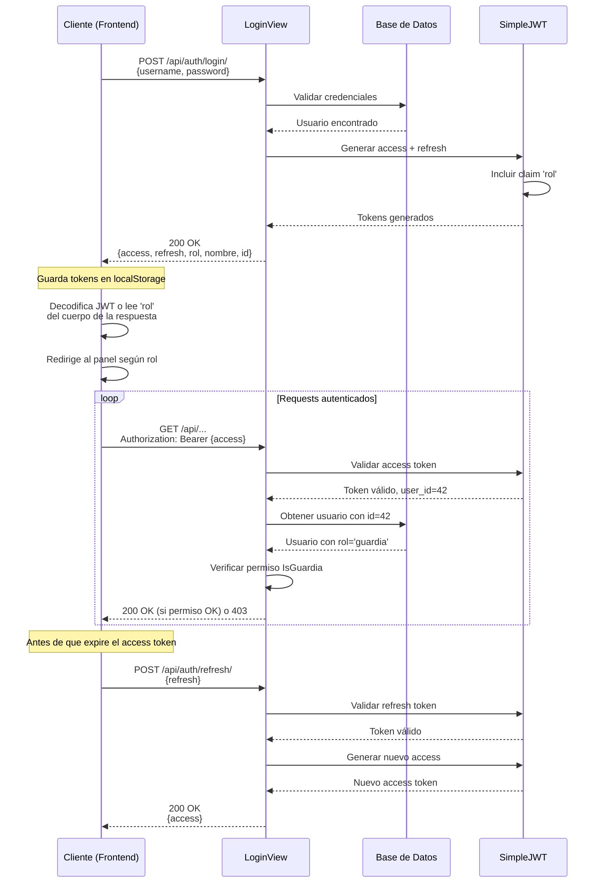

# Documento de Diseño — `cuentas`: Auth, Usuarios y Roles

## Resumen ejecutivo

La app `cuentas` implementa el sistema de autenticación y autorización de Norware. Extiende el modelo de usuario de Django con un sistema de roles obligatorio, ofrece endpoints de login y refresh de tokens JWT, y provee clases de permiso reutilizables para controlar el acceso a las APIs del resto del sistema.

La arquitectura se basa en tres pilares:
1. **Modelo `Usuario` extendido** con campos `rol` y `telefono`
2. **Autenticación JWT stateless** con SimpleJWT, incluyendo el rol como claim personalizado
3. **Permisos DRF basados en rol** con clases `IsDueno`, `IsRRPP`, etc.

**Principales decisiones técnicas:**
- Usar `AbstractUser` en lugar de perfil separado → simplicidad y menos joins
- Roles como CharField con choices → sencillo, sin tabla extra, suficiente para 5 roles fijos
- Claim `rol` en JWT → el frontend redirige al panel correcto sin request adicional
- Autenticación por defecto en DRF → todos los endpoints protegidos salvo que se indique lo contrario
- Duración del access token de 8 horas → suficiente para una noche de evento sin interrupciones

---

## Arquitectura

```
┌────────────────────────────────────────────────────┐
│               Frontend (React)                      │
│                                                     │
│  Login → guarda tokens → incluye JWT en headers    │
└───────────────────┬────────────────────────────────┘
                    │ POST /api/auth/login/
                    │ POST /api/auth/refresh/
                    ▼
┌────────────────────────────────────────────────────┐
│            cuentas.views                            │
│                                                     │
│  ┌──────────────┐      ┌────────────────────────┐ │
│  │  LoginView   │──────│ CustomTokenObtainPair  │ │
│  │ (customizada)│      │ Serializer             │ │
│  └──────────────┘      └────────────────────────┘ │
│           │                                         │
│           ▼                                         │
│  Genera JWT con claim 'rol'                        │
└───────────────────┬────────────────────────────────┘
                    │
                    │ Authorization: Bearer {access}
                    │
                    ▼
┌────────────────────────────────────────────────────┐
│    Middleware: JWTAuthentication                    │
│                                                     │
│    Decodifica JWT → request.user = Usuario         │
└───────────────────┬────────────────────────────────┘
                    │
                    ▼
┌────────────────────────────────────────────────────┐
│    Vistas protegidas (otras apps)                   │
│                                                     │
│  permission_classes = [IsDueno]                    │
│  permission_classes = [IsGuardia]                  │
│           ...                                       │
└────────────────────────────────────────────────────┘
```

**Flujo de autenticación:**
1. Cliente envía username + password → `LoginView`
2. `LoginView` valida credenciales con Django auth
3. `CustomTokenObtainPairSerializer` extiende SimpleJWT para incluir `rol` en el payload
4. Respuesta incluye `access`, `refresh`, `rol`, `nombre`, `id`
5. Frontend decodifica JWT o lee directamente `rol` del cuerpo de la respuesta para redirigir
6. En requests posteriores, frontend envía `Authorization: Bearer {access}`
7. `JWTAuthentication` decodifica el JWT y asigna `request.user`
8. La vista verifica permisos con `IsDueno`, `IsRRPP`, etc.

**Flujo de renovación de token:**
1. Antes de que expire el access token, frontend envía `POST /api/auth/refresh/` con el refresh token
2. SimpleJWT valida el refresh token
3. Si es válido, devuelve un nuevo access token

---

## Componentes e interfaces

### Modelo `Usuario`

```python
# apps/cuentas/models.py
from django.contrib.auth.models import AbstractUser
from django.db import models

class Usuario(AbstractUser):
    ROLES = [
        ('superadmin', 'Super Admin'),
        ('dueno', 'Dueño'),
        ('rrpp', 'RRPP'),
        ('guardia', 'Guardia'),
        ('cajera', 'Cajera'),
    ]
    
    rol = models.CharField(
        max_length=20,
        choices=ROLES,
        help_text="Rol del usuario en la plataforma"
    )
    telefono = models.CharField(
        max_length=20,
        blank=True,
        null=True,
        help_text="Número de teléfono de contacto"
    )
    
    class Meta:
        verbose_name = 'Usuario'
        verbose_name_plural = 'Usuarios'
    
    def __str__(self):
        return f"{self.username} ({self.get_rol_display()})"
```

**Justificación:**
- `rol` como CharField con choices → suficiente para 5 roles fijos, evita complejidad de tabla extra
- Sin valor por defecto para `rol` → obliga a asignarlo explícitamente al crear usuarios
- `telefono` opcional → no todos los usuarios necesitan teléfono (ej: guardia asignado por dueño)

### Serializers

```python
# apps/cuentas/serializers.py
from rest_framework_simplejwt.serializers import TokenObtainPairSerializer
from rest_framework_simplejwt.views import TokenObtainPairView
from .models import Usuario

class CustomTokenObtainPairSerializer(TokenObtainPairSerializer):
    @classmethod
    def get_token(cls, user):
        token = super().get_token(user)
        # Agregar claim personalizado
        token['rol'] = user.rol
        return token
    
    def validate(self, attrs):
        data = super().validate(attrs)
        # Agregar campos extra a la respuesta
        data['rol'] = self.user.rol
        data['nombre'] = f"{self.user.first_name} {self.user.last_name}".strip() or self.user.username
        data['id'] = self.user.id
        return data
```

**Justificación:**
- `get_token` modifica el payload del JWT para incluir `rol` como claim
- `validate` agrega campos a la respuesta JSON para que el frontend no tenga que decodificar el JWT
- Concatenación de `first_name + last_name` con fallback a `username` → maneja usuarios sin nombre completo

### Permisos custom

```python
# apps/cuentas/permissions.py
from rest_framework.permissions import BasePermission

class IsSuperAdmin(BasePermission):
    def has_permission(self, request, view):
        return request.user.is_authenticated and request.user.rol == 'superadmin'

class IsDueno(BasePermission):
    def has_permission(self, request, view):
        return request.user.is_authenticated and request.user.rol == 'dueno'

class IsRRPP(BasePermission):
    def has_permission(self, request, view):
        return request.user.is_authenticated and request.user.rol == 'rrpp'

class IsGuardia(BasePermission):
    def has_permission(self, request, view):
        return request.user.is_authenticated and request.user.rol == 'guardia'

class IsCajera(BasePermission):
    def has_permission(self, request, view):
        return request.user.is_authenticated and request.user.rol == 'cajera'
```

**Uso en vistas:**
```python
# Ejemplo: en apps/puerta/views.py
from apps.cuentas.permissions import IsGuardia

class GuardiaEscanearView(APIView):
    permission_classes = [IsGuardia]
    
    def post(self, request):
        # Solo usuarios con rol='guardia' pueden ejecutar esto
        ...
```

**Justificación:**
- Clases separadas en lugar de un permiso parametrizado → claridad y facilidad de uso
- `has_permission` en lugar de `has_object_permission` → los roles aplican a nivel de vista, no a objetos específicos
- Verificación de `is_authenticated` → evita crash si el request llega sin token

### Vista de login

```python
# apps/cuentas/views.py
from rest_framework_simplejwt.views import TokenObtainPairView
from .serializers import CustomTokenObtainPairSerializer

class LoginView(TokenObtainPairView):
    serializer_class = CustomTokenObtainPairSerializer
```

**Justificación:**
- Reutilización de `TokenObtainPairView` de SimpleJWT → no reinventar la rueda
- Personalización via serializer → limpia separación de concerns

### URLs

```python
# apps/cuentas/urls.py
from django.urls import path
from rest_framework_simplejwt.views import TokenRefreshView
from .views import LoginView

urlpatterns = [
    path('login/', LoginView.as_view(), name='login'),
    path('refresh/', TokenRefreshView.as_view(), name='token_refresh'),
]
```

```python
# config/urls.py
from django.contrib import admin
from django.urls import path, include
from drf_spectacular.views import SpectacularAPIView

urlpatterns = [
    path('admin/', admin.site.urls),
    path('api/auth/', include('apps.cuentas.urls')),
    path('api/schema/', SpectacularAPIView.as_view(), name='schema'),
]
```

**Justificación:**
- Prefijo `/api/auth/` → consistente con el resto de las apps que usan `/api/...`
- Esquema OpenAPI en `/api/schema/` → documentación automática con drf-spectacular

---

## Modelos de datos

### `Usuario` (extendido de `AbstractUser`)

| Campo | Tipo | Restricciones | Descripción |
|-------|------|--------------|-------------|
| `id` | BigAutoField | PK | ID autogenerado |
| `username` | CharField(150) | Unique, Required | Nombre de usuario para login |
| `password` | CharField(128) | Required | Contraseña hasheada |
| `first_name` | CharField(150) | Optional | Nombre |
| `last_name` | CharField(150) | Optional | Apellido |
| `email` | EmailField(254) | Optional | Email |
| `is_staff` | BooleanField | Default: False | Acceso al admin de Django |
| `is_active` | BooleanField | Default: True | Cuenta activa |
| `date_joined` | DateTimeField | Auto now add | Fecha de registro |
| **`rol`** | CharField(20) | Choices, Required | Rol del usuario |
| **`telefono`** | CharField(20) | Optional | Teléfono de contacto |

**Relaciones:**
- Ninguna en esta app; otras apps referenciarán `Usuario` via ForeignKey

**Migraciones:**
- Nueva migración requerida: `0002_usuario_add_rol.py` (agrega campo `rol`)
- Estrategia para migración: si existen usuarios pre-existentes, establecer `rol='dueno'` por defecto y pedir al administrador que corrija manualmente (esto es aceptable en desarrollo temprano)

---

## Propiedades de correctitud

*Una propiedad es una característica o comportamiento que debe cumplirse en todas las ejecuciones válidas del sistema — esencialmente, una afirmación formal sobre lo que el sistema debe hacer. Las propiedades sirven como puente entre especificaciones legibles por humanos y garantías de correctitud verificables por máquinas.*

### Propiedad 1: Permisos de rol verifican correctamente el rol del usuario

*Para cualquier* usuario autenticado con rol `R` y cualquier clase de permiso `PermisoRol` correspondiente a un rol `R_req`, `PermisoRol.has_permission()` SHALL devolver `True` si y solo si `R == R_req`.

**Valida: Requisitos 2.2, 2.3, 2.4, 2.5, 2.6**

### Propiedad 2: La respuesta de login contiene el rol correcto

*Para cualquier* usuario válido con rol `R`, cuando se autentica correctamente en `POST /api/auth/login/`, el campo `rol` de la respuesta JSON debe ser exactamente `R`.

**Valida: Requisito 3.3**

### Propiedad 3: El JWT contiene el claim de rol correcto

*Para cualquier* usuario autenticado con rol `R`, el access token JWT devuelto por login debe contener un claim `rol` con valor exactamente `R` cuando se decodifica.

**Valida: Requisitos 3.8, 8.8**

---

## Manejo de errores

### Escenarios de error y respuestas

| Escenario | Código HTTP | Cuerpo de respuesta |
|-----------|-------------|---------------------|
| Credenciales incorrectas en login | 401 | `{"detail": "No active account found with the given credentials"}` |
| Campos faltantes en request | 400 | `{"username": ["This field is required."], "password": ["This field is required."]}` |
| Token inválido o expirado | 401 | `{"detail": "Given token not valid for any token type", "code": "token_not_valid"}` |
| Acceso denegado por permiso de rol | 403 | `{"detail": "You do not have permission to perform this action."}` |
| Request sin token a endpoint protegido | 401 | `{"detail": "Authentication credentials were not provided."}` |

### Registro de errores

- **Login fallido:** No registrar en logs (podría ser intentos legítimos de usuarios que olvidaron su contraseña). DRF ya registra warnings por defecto.
- **Token inválido:** SimpleJWT registra warnings automáticamente. No es necesario logging adicional salvo que se sospeche ataque.
- **Violaciones de permiso:** DRF registra en nivel `WARNING`. Suficiente para auditorías básicas.

### Validación

- **Validación de modelo:** Django ORM valida que `rol` esté en las choices. Si no, lanza `ValidationError` al hacer `save()` o `full_clean()`.
- **Validación de request:** DRF serializers validan campos requeridos. Si falta `username` o `password`, devuelve 400 con detalles de qué falta.

---

## Estrategia de testing

### Enfoque dual: Unit tests + Property-based tests

La estrategia combina **tests unitarios** para casos específicos y edge cases con **tests basados en propiedades** para verificar comportamientos universales.

**Unit tests:**
- Casos concretos de login exitoso y fallido
- Validación de modelo con valores inválidos
- Verificación de configuración (settings, URLs)
- Casos de error específicos (token expirado, refresh inválido)

**Property-based tests:**
- Permisos de rol con generación de usuarios aleatorios
- Respuesta de login para usuarios de cualquier rol
- Claim de rol en JWT para usuarios de cualquier rol

### Configuración de property tests

- **Biblioteca:** `hypothesis` para Python/Django
- **Iteraciones mínimas:** 100 ejemplos por propiedad
- **Estrategias de generación:**
  - `usuarios_con_rol`: genera usuarios con cualquiera de los 5 roles
  - `credenciales_validas`: genera pares username/password válidos
  - `tokens_jwt`: genera tokens con diferentes claims

### Tests específicos requeridos

**Unit tests en `apps/cuentas/tests.py`:**
1. `test_login_exitoso_devuelve_tokens_y_datos` — verifica campos en respuesta
2. `test_login_con_credenciales_incorrectas_devuelve_401` — caso de error
3. `test_endpoint_protegido_sin_token_devuelve_401` — autenticación requerida
4. `test_endpoint_protegido_con_rol_incorrecto_devuelve_403` — permiso denegado
5. `test_refresh_token_valido_devuelve_nuevo_access` — renovación exitosa
6. `test_refresh_token_expirado_devuelve_401` — token caducado
7. `test_modelo_usuario_tiene_campos_rol_y_telefono` — verificación de esquema
8. `test_usuario_sin_rol_falla_validacion` — validación de modelo
9. `test_fixtures_usuarios_prueba_cargan_correctamente` — `loaddata` exitoso

**Property tests en `apps/cuentas/tests_properties.py`:**
1. **Propiedad 1:** `test_property_permisos_verifican_rol_correcto`
   - Generador: usuarios con roles aleatorios
   - Tag: **Feature: cuentas, Property 1: Permisos de rol verifican correctamente el rol del usuario**
   
2. **Propiedad 2:** `test_property_respuesta_login_contiene_rol_correcto`
   - Generador: usuarios válidos con credenciales conocidas
   - Tag: **Feature: cuentas, Property 2: La respuesta de login contiene el rol correcto**
   
3. **Propiedad 3:** `test_property_jwt_contiene_claim_rol_correcto`
   - Generador: usuarios válidos autenticados
   - Tag: **Feature: cuentas, Property 3: El JWT contiene el claim de rol correcto**

### Cobertura esperada

- **Modelo `Usuario`:** 100% (simple, solo definición de campos)
- **Serializers:** 100% (lógica mínima, custom claims)
- **Permisos custom:** 100% (lógica simple, cubierta por property tests)
- **Vistas:** 95%+ (algunas rutas de error de SimpleJWT no necesitan cobertura explícita)

### Tests de integración

No requeridos en esta fase. Los tests unitarios usan `APIClient` de DRF que ya simula el flujo HTTP completo. Una vez que las otras apps (`boliches`, `eventos`, etc.) estén implementadas, se agregarán tests de integración end-to-end que validen el flujo completo desde login hasta operaciones protegidas.

---

## Configuración de Django settings

### Cambios requeridos en `config/settings.py`

```python
from datetime import timedelta
from decouple import config

# ... resto del archivo ...

INSTALLED_APPS = [
    'django.contrib.admin',
    'django.contrib.auth',
    'django.contrib.contenttypes',
    'django.contrib.sessions',
    'django.contrib.messages',
    'django.contrib.staticfiles',
    
    # Third-party
    'corsheaders',
    'rest_framework',
    'rest_framework_simplejwt',
    'drf_spectacular',
    
    # Apps locales
    'apps.cuentas',
]

MIDDLEWARE = [
    'django.middleware.security.SecurityMiddleware',
    'corsheaders.middleware.CorsMiddleware',  # Antes de CommonMiddleware
    'django.contrib.sessions.middleware.SessionMiddleware',
    'django.middleware.common.CommonMiddleware',
    'django.middleware.csrf.CsrfViewMiddleware',
    'django.contrib.auth.middleware.AuthenticationMiddleware',
    'django.contrib.messages.middleware.MessageMiddleware',
    'django.middleware.clickjacking.XFrameOptionsMiddleware',
]

# Django Rest Framework
REST_FRAMEWORK = {
    'DEFAULT_AUTHENTICATION_CLASSES': [
        'rest_framework_simplejwt.authentication.JWTAuthentication',
    ],
    'DEFAULT_PERMISSION_CLASSES': [
        'rest_framework.permissions.IsAuthenticated',
    ],
    'DEFAULT_SCHEMA_CLASS': 'drf_spectacular.openapi.AutoSchema',
}

# SimpleJWT
SIMPLE_JWT = {
    'ACCESS_TOKEN_LIFETIME': timedelta(hours=8),
    'REFRESH_TOKEN_LIFETIME': timedelta(days=7),
    'ROTATE_REFRESH_TOKENS': False,
    'BLACKLIST_AFTER_ROTATION': False,
    'UPDATE_LAST_LOGIN': False,
    'ALGORITHM': 'HS256',
    'SIGNING_KEY': SECRET_KEY,
    'VERIFYING_KEY': None,
    'AUTH_HEADER_TYPES': ('Bearer',),
    'USER_ID_FIELD': 'id',
    'USER_ID_CLAIM': 'user_id',
    'AUTH_TOKEN_CLASSES': ('rest_framework_simplejwt.tokens.AccessToken',),
    'TOKEN_TYPE_CLAIM': 'token_type',
}

# CORS
CORS_ALLOWED_ORIGINS = config(
    'CORS_ALLOWED_ORIGINS',
    default='http://localhost:5173'
).split(',')

# drf-spectacular
SPECTACULAR_SETTINGS = {
    'TITLE': 'Norware API',
    'DESCRIPTION': 'Backend de la plataforma de venta y control de acceso para boliches',
    'VERSION': '1.0.0',
    'SERVE_INCLUDE_SCHEMA': False,
}

# Usuario personalizado
AUTH_USER_MODEL = 'cuentas.Usuario'  # Ya existe
```

### Variables de entorno requeridas (`.env`)

```bash
# CORS
CORS_ALLOWED_ORIGINS=http://localhost:5173,http://localhost:3000
```

---

## Fixtures de prueba

### Archivo: `api/fixtures/usuarios_prueba.json`

Contiene 5 usuarios con contraseñas conocidas para desarrollo:

| username | password | rol | Descripción |
|----------|----------|-----|-------------|
| `admin` | `admin123` | `superadmin` | Acceso total a la plataforma |
| `carlos_dueno` | `dueno123` | `dueno` | Dueño de un boliche |
| `juan_rrpp` | `rrpp123` | `rrpp` | RRPP asignado a eventos |
| `maria_guardia` | `guardia123` | `guardia` | Guardia de puerta |
| `ana_cajera` | `cajera123` | `cajera` | Cajera que procesa pagos |

**Uso:**
```bash
python manage.py loaddata usuarios_prueba
```

**Generación del fixture:**
Se puede generar ejecutando un script Django management command que cree los usuarios con `make_password()` y luego exporte con `dumpdata`:

```bash
python manage.py crear_usuarios_prueba
python manage.py dumpdata cuentas.Usuario --indent 2 > api/fixtures/usuarios_prueba.json
```

---

## Dependencias

### Paquetes de Python (ya instalados en `requirements.txt`)

```
Django==6.0.7
djangorestframework==3.17.1
djangorestframework_simplejwt==5.5.1
django-cors-headers==4.9.0
drf-spectacular==0.30.0
python-decouple==3.8
hypothesis==6.x  # Para property-based tests (AGREGAR)
```

**Nota:** `hypothesis` debe agregarse a `requirements.txt` para los property tests.

---

## Notas de implementación

### Migración de usuarios existentes

Si existen usuarios creados antes de agregar el campo `rol`, la migración debe manejarlo. Estrategia recomendada:

```python
# En la migración 0002_usuario_add_rol.py
def asignar_rol_default(apps, schema_editor):
    Usuario = apps.get_model('cuentas', 'Usuario')
    for usuario in Usuario.objects.filter(rol__isnull=True):
        # Asignar rol por defecto
        if usuario.is_superuser:
            usuario.rol = 'superadmin'
        else:
            usuario.rol = 'dueno'  # Asumir dueño por defecto
        usuario.save()

class Migration(migrations.Migration):
    dependencies = [
        ('cuentas', '0001_initial'),
    ]

    operations = [
        migrations.AddField(
            model_name='usuario',
            name='rol',
            field=models.CharField(
                max_length=20,
                choices=[...],
                null=True  # Temporalmente nullable
            ),
        ),
        migrations.RunPython(asignar_rol_default),
        migrations.AlterField(
            model_name='usuario',
            name='rol',
            field=models.CharField(
                max_length=20,
                choices=[...],
                null=False  # Ahora requerido
            ),
        ),
    ]
```

### Admin de Django

Registrar `Usuario` en el admin con display de rol:

```python
# apps/cuentas/admin.py
from django.contrib import admin
from django.contrib.auth.admin import UserAdmin
from .models import Usuario

@admin.register(Usuario)
class UsuarioAdmin(UserAdmin):
    list_display = ['username', 'rol', 'first_name', 'last_name', 'is_staff']
    list_filter = ['rol', 'is_staff', 'is_superuser', 'is_active']
    fieldsets = UserAdmin.fieldsets + (
        ('Rol y Contacto', {'fields': ('rol', 'telefono')}),
    )
    add_fieldsets = UserAdmin.add_fieldsets + (
        ('Rol y Contacto', {'fields': ('rol', 'telefono')}),
    )
```

### Seguridad

- **SECRET_KEY:** Debe leerse de variable de entorno en producción (`config('SECRET_KEY')`)
- **CORS:** Configurar origins permitidos estrictamente en producción (no usar `*`)
- **HTTPS:** El frontend debe enviar tokens solo sobre HTTPS en producción
- **Contraseñas:** Django hashea automáticamente con PBKDF2. No cambiar el algoritmo por defecto.

### Performance

- **Autenticación:** `JWTAuthentication` no hace queries adicionales más allá de obtener `request.user` si el token es válido. Performance óptima.
- **Permisos:** `has_permission` solo verifica `request.user.rol`, sin queries. Complejidad O(1).
- **Login:** Una query para validar credenciales + generación de JWT. Rápido.

No se requieren optimizaciones adicionales en esta fase.

---

## Diagrama de flujo de autenticación



---

## Referencias

- [Django Authentication System](https://docs.djangoproject.com/en/5.1/topics/auth/)
- [Django Rest Framework Permissions](https://www.django-rest-framework.org/api-guide/permissions/)
- [djangorestframework-simplejwt Documentation](https://django-rest-framework-simplejwt.readthedocs.io/)
- [drf-spectacular Documentation](https://drf-spectacular.readthedocs.io/)
- [Hypothesis for Python](https://hypothesis.readthedocs.io/)
